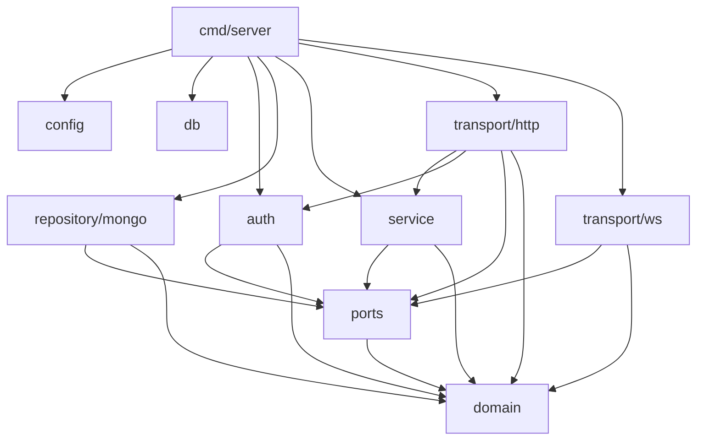

# Архитектура — Couple Notes (Zametka) backend

Полный документ для `go-coder`. Решения по продукту для MVP зафиксированы (не открытые):

1. **Реакции:** один emoji на участника на заметку (upsert по `memberId`). `DELETE` снимает реакцию этого участника (поле `emoji` в теле не требуется; если передано — игнорируется или проверяется на совпадение — см. контракт).
2. **Заметки:** только автор может `PATCH` (content/title/category/color/pin) и `DELETE`. Любой участник комнаты может создавать заметки и ставить/снимать свою реакцию. Чужие заметки при попытке изменить/удалить → `403 FORBIDDEN`.

---

## Контекст и цели

**Текущее состояние:** greenfield. `backend/go.mod` = `module zametka`, `backend/main.go` — заглушка GoLand. Нужно построить весь backend.

**Решения (зафиксированы):**

**Module path → `zametka`.**  
`go.mod` лежит в `backend/`, корень модуля = `backend/`. Префикс `zametka/backend` имел бы смысл только при `go.mod` в корне репозитория. Импорты: `zametka/internal/...`. Оставляем `zametka`. Удалить старый `backend/main.go` после появления `cmd/server`.

**Token transport → `Authorization: Bearer <jwt>`.**  
Next.js на `:3000`, API на `:8080`. Header проще cookie: без `AllowCredentials`, `SameSite`, CSRF. Токен в `localStorage`. Для WS (браузерный WebSocket не задаёт заголовки) — query `?token=...`.  
**CORS:** `AllowOrigins=$CORS_ORIGINS` (default `http://localhost:3000`), `AllowHeaders=Authorization,Content-Type`, `AllowCredentials=false`.

**Стек:** Fiber v2, MongoDB (`mongo-driver`), `gofiber/contrib/websocket`, `jwt/v5` (HS256), `google/uuid`, Go 1.25.x.

**Цель:** слои `cmd → transport → service → ports ← adapters`, без циклов импорта, атомарный join (max 2), потокобезопасный WS-хаб, realtime после мутаций.

**Data flow:** create room → join by code → JWT → WS subscribe → create note → Broadcast.

---

## Схема пакетов

Точное дерево (всё под `backend/`):

```
backend/
├── go.mod                       # module zametka
├── go.sum
├── .env.example
├── cmd/
│   └── server/
│       └── main.go              # DI wiring, точка входа
└── internal/
    ├── config/
    │   └── config.go            # env → Config, валидация
    ├── db/
    │   └── mongo.go             # Connect, EnsureIndexes
    ├── domain/                  # ЛИСТ: типы + sentinel-ошибки; НЕТ инфра-импортов
    │   ├── room.go
    │   ├── note.go
    │   └── errors.go
    ├── ports/                   # интерфейсы; импортит только domain
    │   └── ports.go
    ├── auth/
    │   ├── token.go             # TokenIssuer (jwt/v5 HS256)
    │   └── middleware.go        # Fiber → Locals(roomID, memberID)
    ├── repository/
    │   └── mongo/
    │       ├── room_repo.go
    │       └── note_repo.go
    ├── service/
    │   ├── room_service.go
    │   └── note_service.go
    └── transport/
        ├── http/
        │   ├── dto.go
        │   ├── response.go      # error → HTTP
        │   ├── router.go
        │   ├── rooms_handler.go
        │   ├── notes_handler.go
        │   └── reactions_handler.go
        └── ws/
            ├── hub.go           # Hub; реализует ports.Broadcaster
            ├── client.go
            ├── events.go
            └── handler.go       # GET /ws
```

Граф зависимостей (стрелка = «импортирует»):



**Инвариант против циклов:** `domain` не импортит ничего внутреннего. `ports` импортит только `domain`. `service` не импортит `ws` / `repository/mongo` — только `ports`. Хаб инжектится как `ports.Broadcaster`. `Client` наружу из `ws` не выносится.

---

## Интерфейсы и типы

### domain — модели и value objects

```go
// domain/room.go
type Member struct {
    ID       string    `bson:"id"       json:"id"`
    Name     string    `bson:"name"     json:"name"`
    Color    string    `bson:"color"    json:"color"`
    JoinedAt time.Time `bson:"joinedAt" json:"joinedAt"`
}

type Room struct {
    ID        string    `bson:"_id"       json:"id"`       // uuid v4 string
    Code      string    `bson:"code"      json:"code"`     // unique join code
    Title     string    `bson:"title"     json:"title"`
    CreatedAt time.Time `bson:"createdAt" json:"createdAt"`
    Members   []Member  `bson:"members"   json:"members"`  // max 2
}
```

```go
// domain/note.go
type Category string

const (
    CategoryIdea    Category = "idea"
    CategoryDate    Category = "date"
    CategoryGift    Category = "gift"
    CategoryMovie   Category = "movie"
    CategoryTravel  Category = "travel"
    CategoryThought Category = "thought"
    CategoryOther   Category = "other"
)

func (c Category) Valid() bool // true iff one of the constants above

type Reaction struct {
    MemberID string `bson:"memberId" json:"memberId"`
    Emoji    string `bson:"emoji"    json:"emoji"`
}

type Note struct {
    ID        string     `bson:"_id"                 json:"id"`
    RoomID    string     `bson:"roomId"              json:"roomId"`
    AuthorID  string     `bson:"authorId"            json:"authorId"`
    Title     string     `bson:"title,omitempty"     json:"title,omitempty"`
    Content   string     `bson:"content"             json:"content"`
    Category  Category   `bson:"category"            json:"category"`
    Color     string     `bson:"color,omitempty"     json:"color,omitempty"` // mood/color
    Pinned    bool       `bson:"pinned"              json:"pinned"`
    Reactions []Reaction `bson:"reactions"           json:"reactions"` // always [] not null
    CreatedAt time.Time  `bson:"createdAt"           json:"createdAt"`
    UpdatedAt time.Time  `bson:"updatedAt"           json:"updatedAt"`
}

// Inputs / filters — no bson tags
type NoteCreate struct {
    Title    string
    Content  string
    Category Category
    Color    string
    Pinned   bool
}

type NoteUpdate struct { // pointers = partial PATCH; only author may apply
    Title    *string
    Content  *string
    Category *Category
    Color    *string
    Pinned   *bool
}

type NoteFilter struct {
    RoomID   string
    Category *Category
    Limit    int64      // default 50, max 100
    Before   *time.Time // cursor by createdAt (older than)
}
```

**BSON/JSON guidance:**
- `_id` — строковый UUID (не ObjectID); совпадает с JWT `sub`/`rid`.
- `omitempty` только для опциональных `title`, `color`.
- `reactions` всегда инициализировать как `[]Reaction{}` (не nil → не `null` в JSON).
- Все `time.Time` в UTC.

### domain — sentinels

```go
// domain/errors.go
var (
    ErrRoomNotFound = errors.New("room not found")
    ErrRoomFull     = errors.New("room is full")
    ErrCodeTaken    = errors.New("join code already exists")
    ErrNoteNotFound = errors.New("note not found")
    ErrUnauthorized = errors.New("unauthorized")
    ErrForbidden    = errors.New("forbidden") // non-author PATCH/DELETE
    ErrValidation   = errors.New("validation error") // wrap: fmt.Errorf("%w: ...", ErrValidation)
)
```

### ports — финальные сигнатуры

```go
package ports

import (
    "context"
    "zametka/internal/domain"
)

type RoomRepository interface {
    Create(ctx context.Context, room *domain.Room) error
    // duplicate code unique index → domain.ErrCodeTaken
    GetByID(ctx context.Context, id string) (*domain.Room, error)
    // missing → domain.ErrRoomNotFound
    GetByCode(ctx context.Context, code string) (*domain.Room, error)
    // AddMember atomically appends if len(members) < 2.
    // Returns updated room.
    // ErrRoomFull if already 2; ErrRoomNotFound if no such code.
    AddMember(ctx context.Context, code string, m domain.Member) (*domain.Room, error)
}

type NoteRepository interface {
    Create(ctx context.Context, n *domain.Note) error
    GetByID(ctx context.Context, roomID, id string) (*domain.Note, error)
    // missing or wrong room → domain.ErrNoteNotFound
    List(ctx context.Context, f domain.NoteFilter) ([]domain.Note, error)
    Update(ctx context.Context, roomID, id string, upd domain.NoteUpdate) (*domain.Note, error)
    Delete(ctx context.Context, roomID, id string) error
    // UpsertReaction: one reaction per memberId on the note.
    // If member already has a reaction → replace emoji; else push.
    UpsertReaction(ctx context.Context, roomID, noteID, memberID, emoji string) (*domain.Note, error)
    // RemoveReaction: remove that member's reaction (any emoji).
    // If none → still return current note (idempotent) OR ErrNoteNotFound if note missing.
    RemoveReaction(ctx context.Context, roomID, noteID, memberID string) (*domain.Note, error)
}

type RoomService interface {
    Create(ctx context.Context, title, name, color string) (room *domain.Room, token string, err error)
    Join(ctx context.Context, code, name, color string) (room *domain.Room, token string, err error)
    Get(ctx context.Context, roomID string) (*domain.Room, error)
}

type NoteService interface {
    List(ctx context.Context, roomID string, f domain.NoteFilter) ([]domain.Note, error)
    Create(ctx context.Context, roomID, authorID string, in domain.NoteCreate) (*domain.Note, error)
    // Update: only if note.AuthorID == memberID; else ErrForbidden
    Update(ctx context.Context, roomID, memberID, noteID string, upd domain.NoteUpdate) (*domain.Note, error)
    // Delete: only if note.AuthorID == memberID; else ErrForbidden
    Delete(ctx context.Context, roomID, memberID, noteID string) error
    AddReaction(ctx context.Context, roomID, memberID, noteID, emoji string) (*domain.Note, error)
    RemoveReaction(ctx context.Context, roomID, memberID, noteID string) (*domain.Note, error)
}

// Narrow interface for services. Implemented by ws.Hub.
type Broadcaster interface {
    Broadcast(roomID string, ev Event)
}

type Event struct {
    Type string `json:"type"` // note.created | note.updated | note.deleted | reaction.updated | member.joined
    Data any    `json:"data"`
}

type Claims struct {
    RoomID   string
    MemberID string
}

type TokenIssuer interface {
    Issue(roomID, memberID string) (string, error)
    Parse(token string) (Claims, error) // invalid/expired → domain.ErrUnauthorized
}
```

---

## Auth design

- **Алгоритм:** HS256 (HMAC).
- **Секрет:** `JWT_SECRET` из env, обязателен, длина ≥ 32 байта; иначе паника/`Validate` fail при старте.
- **Claims:** `jwt.RegisteredClaims` + кастом:
  - `rid` — roomID  
  - `sub` — memberID  
  - `iat`, `exp`  
  - `iss` = `"zametka"`
- **TTL:** `JWT_TTL`, default `720h` (30 дней). Refresh нет.
- **Transport:** REST — `Authorization: Bearer <token>`. WS — `?token=<token>`.
- **Middleware** `auth.RequireAuth(issuer)`:
  1. Извлечь токен (Bearer или query для upgrade path).
  2. `issuer.Parse` → ошибка → `401` (`ErrUnauthorized`).
  3. `c.Locals("roomID", claims.RoomID)`, `c.Locals("memberID", claims.MemberID)`.
- **Хелперы:** `httpx.RoomID(c)`, `httpx.MemberID(c)` (или локальные в `transport/http`).
- **Protected:** `/api/rooms/me`, все `/api/notes*`, `/ws`.  
  **Public:** `POST /api/rooms`, `POST /api/rooms/join`.

---

## Atomic join algorithm

Гонка (двое жмут join, лимит 2) — один Mongo `FindOneAndUpdate`:

```
filter = {
  "code": <code>,
  "$expr": { "$lt": [ { "$size": "$members" }, 2 ] }
}
update = { "$push": { "members": <newMember> } }
opts   = ReturnDocument(After)
```

В `RoomRepository.AddMember`:
1. Выполнить `FindOneAndUpdate`.
2. Документ вернулся → успех, вернуть комнату.
3. `ErrNoDocuments` → `GetByCode(code)`:
   - комната есть, `len(members) >= 2` → `domain.ErrRoomFull`;
   - комнаты нет → `domain.ErrRoomNotFound`.

Атомарность `$expr $size < 2` не даёт третьему участнику пройти.

**Генерация join-кода** (`RoomService.Create`): 6 символов, алфавит Crockford-like без `I O L U 0 1` (например `ABCDEFGHJKMNPQRSTVWXYZ23456789`), `crypto/rand`. При `ErrCodeTaken` — ретрай до 5 раз, затем ошибка 500.

---

## База данных

### Коллекции

**rooms:** `_id` (string UUID), `code` (unique), `title`, `createdAt`, `members[{id,name,color,joinedAt}]` max 2.

**notes:** `_id`, `roomId`, `authorId`, `title?`, `content`, `category`, `color?`, `pinned`, `reactions[{memberId,emoji}]`, `createdAt`, `updatedAt`.

### Индексы (`db.EnsureIndexes` при старте, идемпотентно)

**rooms:**
- `{ code: 1 }` — **unique**.

**notes:**
- `{ roomId: 1, createdAt: -1 }` — листинг / пагинация.
- `{ roomId: 1, category: 1, createdAt: -1 }` — фильтр по категории.

Все запросы к notes всегда включают `roomId` (изоляция комнат).

### Реакции в Mongo (upsert одной реакции на member)

Рекомендуемая реализация `UpsertReaction`:
1. `UpdateOne` с filter `{ _id, roomId, "reactions.memberId": memberID }` и `$set: { "reactions.$.emoji": emoji, updatedAt }`.
2. Если `MatchedCount == 0` — `$push` новой `{ memberId, emoji }` (и `$set updatedAt`), filter только `{ _id, roomId }`.
3. Вернуть обновлённый документ (`FindOne` или `FindOneAndUpdate` с return after).

`RemoveReaction`: `$pull: { reactions: { memberId: memberID } }`, затем вернуть note.

Либо одна pipeline update — на усмотрение coder; семантика обязательна: **один emoji на memberId**.

### Авторство

- `Update` / `Delete` в **service** (не repo): загрузить note → если `AuthorID != memberID` → `ErrForbidden`; иначе repo.
- Repo остаётся «тупым» по roomId+id.

---

## API

### REST — контракты

Базовый префикс `/api`. Ошибки:

```json
{ "error": { "code": "ROOM_FULL", "message": "..." } }
```

| sentinel | HTTP | code |
|---|---|---|
| `ErrValidation` | 400 | `VALIDATION` |
| `ErrUnauthorized` | 401 | `UNAUTHORIZED` |
| `ErrForbidden` | 403 | `FORBIDDEN` |
| `ErrRoomNotFound` | 404 | `ROOM_NOT_FOUND` |
| `ErrNoteNotFound` | 404 | `NOTE_NOT_FOUND` |
| `ErrRoomFull` | 409 | `ROOM_FULL` |
| `ErrCodeTaken` | 409 | `CODE_TAKEN` |
| other | 500 | `INTERNAL` |

**POST /api/rooms** (public) — создать  
Request:
```json
{ "title": "Наши заметки", "name": "Alex", "color": "#f28b82" }
```
Response `201`:
```json
{ "room": { /* Room */ }, "token": "<jwt>", "code": "K7M4QP" }
```

**POST /api/rooms/join** (public)  
Request:
```json
{ "code": "K7M4QP", "name": "Sam", "color": "#a7ffeb" }
```
Response `200`: `{ "room": { /* Room */ }, "token": "<jwt>" }`  
Errors: `404 ROOM_NOT_FOUND` | `409 ROOM_FULL` | `400 VALIDATION`

**GET /api/rooms/me** (auth) → `200 { "room": { /* Room */ } }`

**GET /api/notes** (auth)  
Query: `category`, `limit` (≤100, default 50), `before` (RFC3339).  
Response `200`:
```json
{ "notes": [ /* Note */ ], "nextBefore": "2026-07-16T20:00:00Z" }
```
`nextBefore` = `null` если больше нет страниц (или опустить).

**POST /api/notes** (auth)  
Request:
```json
{ "title": "", "content": "...", "category": "gift", "color": "#fff", "pinned": false }
```
Response `201`: полный `Note`.  
`400 VALIDATION` — пустой content / неверная category.

**PATCH /api/notes/:id** (auth, **только author**)  
Request (все поля опциональны):
```json
{ "title": "...", "content": "...", "category": "idea", "color": "#fff", "pinned": true }
```
Response `200`: `Note`.  
`403 FORBIDDEN` — не автор; `404 NOTE_NOT_FOUND`.

**DELETE /api/notes/:id** (auth, **только author**) → `204`.  
`403 FORBIDDEN` | `404 NOTE_NOT_FOUND`.

**POST /api/notes/:id/reactions** (auth, любой member комнаты)  
Request: `{ "emoji": "❤️" }`  
Response `200`: `Note` (реакция member upsert’нута).

**DELETE /api/notes/:id/reactions** (auth)  
Тело опционально / пустое. Снимается реакция текущего `memberID`.  
Response `200`: `Note`.

**GET /ws?token=&lt;jwt&gt;** — WebSocket upgrade.

Права (сводка):
| Действие | Кто |
|---|---|
| List / create note | любой member комнаты |
| PATCH / DELETE note | только `authorId` |
| Add / remove own reaction | любой member комнаты |
| Чужой roomId | всегда `404` (не раскрывать) |

### WS — payload shapes

Сервер → клиенты комнаты: `{"type":"...","data":{...}}`. Клиент→сервер сообщений в MVP нет (только ping/pong служебный).

```jsonc
// note.created / note.updated — data = полный Note
{ "type": "note.created", "data": { /* Note */ } }
{ "type": "note.updated", "data": { /* Note */ } }

// note.deleted
{ "type": "note.deleted", "data": { "id": "<noteId>" } }

// reaction.updated — data = полный Note
{ "type": "reaction.updated", "data": { /* Note */ } }

// member.joined
{ "type": "member.joined", "data": { /* Member */ } }
```

**Hub concurrency:**
- `map[roomID]map[*Client]struct{}` под `sync.RWMutex` **или** каналы register/unregister/broadcast + одна горутина `Run(ctx)`.
- У каждого `Client` — буфер `send chan []byte` + write-горутина.
- Переполнение буфера → закрыть клиента (slow consumer), не блокировать хаб.
- `Broadcast(roomID, ev)`: marshal один раз; неблокирующая отправка (`select` + `default` drop/close).
- Register/unregister на connect/disconnect; чистить пустые комнаты.
- `Run(ctx)` завершается по отмене контекста.

---

## Config env vars

`.env.example`:

```
PORT=8080
MONGO_URI=mongodb://localhost:27017
MONGO_DB=zametka
JWT_SECRET=change-me-min-32-bytes-long-secret!!
JWT_TTL=720h
CORS_ORIGINS=http://localhost:3000
ENV=dev
```

`config.Load()` → `Config` + `Validate()`:
- `JWT_SECRET` обязателен, `len >= 32`;
- дефолты: `PORT=8080`, `MONGO_DB=zametka`, `JWT_TTL=720h`, `CORS_ORIGINS=http://localhost:3000`.

---

## DI / wiring в `cmd/server/main.go`

Порядок сборки (ручные конструкторы):

1. `cfg := config.Load()` → `cfg.Validate()`.
2. `mongoClient := db.Connect(ctx, cfg)`; `db.EnsureIndexes(ctx, mongoClient, cfg.DB)`.
3. `issuer := auth.NewTokenIssuer(cfg.JWTSecret, cfg.JWTTTL)`.
4. `hub := ws.NewHub()`; `go hub.Run(ctx)`.
5. `roomRepo := mongo.NewRoomRepository(db)`; `noteRepo := mongo.NewNoteRepository(db)`.
6. `roomSvc := service.NewRoomService(roomRepo, issuer, hub)`; `noteSvc := service.NewNoteService(noteRepo, hub)`.
7. `app := fiber.New(...)`; CORS (`CORS_ORIGINS`); recover; logger.
8. `httptransport.RegisterRoutes(app, roomSvc, noteSvc, issuer)`; `ws.RegisterWS(app, hub, issuer)`.
9. `app.Listen(":"+cfg.Port)` + graceful shutdown: SIGINT/SIGTERM → cancel ctx → hub stop → `app.Shutdown()`.

Конструкторы принимают `ports.*` интерфейсы (не конкретику), кроме `*fiber.App`.

---

## План реализации для go-coder

Каждый шаг = одна сессия go-coder. После логики/конкурентности → go-tester. Порядок снизу вверх по графу (без циклов).

### Шаг 0 — Scaffold + зависимости

- Обновить `go.mod` до `go 1.25` (или совместимой версии toolchain).
- `go get`: Fiber v2, `github.com/gofiber/contrib/websocket`, `github.com/golang-jwt/jwt/v5`, `github.com/google/uuid`, `go.mongodb.org/mongo-driver`.
- Создать дерево пакетов (пустые/минимальные файлы).
- `cmd/server/main.go` — поднимает пустой Fiber на `PORT` (или 8080).
- Удалить старый `backend/main.go`.

**Acceptance:** `go build ./...` зелёный; `go run ./cmd/server` слушает порт.

---

### Шаг 1 — config + db

- `config.Load` / `Validate` (env, дефолты, секрет ≥32).
- `db.Connect` (ping с таймаутом).
- `db.EnsureIndexes`: rooms `code` unique; notes `(roomId, createdAt)`, `(roomId, category, createdAt)`.

**Acceptance:** пустой/`short` `JWT_SECRET` → старт с понятной ошибкой; валидный конфиг → коннект Mongo + индексы без ошибок.

---

### Шаг 2 — domain + ports

- Типы Room, Member, Note, Category+`Valid()`, Reaction, NoteCreate/Update/Filter.
- `errors.go` — все sentinels выше.
- Все интерфейсы `ports` + `Event`, `Claims` (включая `UpsertReaction` / `RemoveReaction` без emoji в Remove).

**Acceptance:** `go build ./...`; `domain` и `ports` не импортят инфру; unit на `Category.Valid()`.

---

### Шаг 3 — repository/mongo

- `RoomRepository`: Create (`ErrCodeTaken` на duplicate key), GetByID, GetByCode, **AddMember** с `$expr $size < 2` + различение full/not-found.
- `NoteRepository`: Create, GetByID(+roomId), List (filter/limit/before, sort createdAt desc), Update (`$set` по указателям + updatedAt), Delete, **UpsertReaction** (один emoji на memberId), **RemoveReaction** (pull by memberId).

**Acceptance (go-tester, Mongo/testcontainers):**
- третий join → `ErrRoomFull`;
- параллельные join не дают 3 членов;
- List фильтрует по roomId+category;
- два Upsert одного member → одна реакция с последним emoji;
- RemoveReaction идемпотентен при отсутствии реакции.

---

### Шаг 4 — auth

- `NewTokenIssuer`: Issue HS256 (`rid`, `sub`, `iat`, `exp`, `iss=zametka`); Parse (alg+exp) → `ErrUnauthorized`.
- `RequireAuth`: Bearer для REST; для WS path — `?token=`.
- Locals `roomID` / `memberID` + хелперы.

**Acceptance:** unit Issue→Parse round-trip; expired/tampered → `ErrUnauthorized`; `go test -race` чистый.

---

### Шаг 5 — RoomService

- `Create`: валидация name/color (непустые), генерация кода + ретрай, UUID room/member, Repo.Create, Issue token.
- `Join`: валидация, UUID member, AddMember, Issue token, `Broadcast(member.joined)`.
- `Get`: GetByID.

**Acceptance:** unit с моками — Create → room+token+code; Join full → `ErrRoomFull`; Join шлёт `member.joined`.

---

### Шаг 6 — NoteService

- List / Create (валидация content+category; `Reactions=[]`; timestamps; broadcast `note.created`).
- **Update / Delete:** load note → `AuthorID != memberID` → `ErrForbidden`; иначе repo + broadcast `note.updated` / `note.deleted`.
- AddReaction / RemoveReaction: любой member комнаты (note в той же room); broadcast `reaction.updated`.
- Невалидный input → `ErrValidation`; чужая/отсутствующая note → `ErrNoteNotFound`.

**Acceptance:** unit — non-author Update/Delete → `ErrForbidden`; author OK + правильные Event.Type; reaction upsert/remove шлют `reaction.updated`.

---

### Шаг 7 — WS hub + client + handler

- Hub (register/unregister/broadcast, concurrency-safe), Client с буфером, drop slow consumer, `ports.Broadcaster`.
- `/ws`: upgrade, Parse token, register by roomID, read-loop ping/close.
- `Run(ctx)` + cleanup.

**Acceptance:** `go test -race` без гонок; broadcast только в свою комнату; disconnect чистит map; slow client не блокирует хаб.

---

### Шаг 8 — HTTP handlers + DTO + router + response

- DTO request/response; маппинг domain↔DTO на границе.
- `response.go` — таблица ошибок выше.
- Handlers rooms / notes / reactions.
- `RegisterRoutes`: public vs auth groups + middleware.
- DELETE reactions без тела / без emoji в контракте.

**Acceptance:** все эндпоинты отдают коды из контракта; единый error envelope; non-author PATCH/DELETE → 403; чужая комната → 404.

---

### Шаг 9 — main wiring + CORS + graceful shutdown

- Собрать DI по разделу выше.
- CORS из `CORS_ORIGINS`; recover; logger.
- SIGINT/SIGTERM → cancel → hub stop → `app.Shutdown()`.

**Acceptance (E2E вручную):** create room → join вторым → оба `/ws` → один создаёт note → второй получает `note.created`; non-author DELETE → 403; reaction upsert → `reaction.updated`; Ctrl+C — чистый выход.

---

## Риски (закрытые продуктовые вопросы — не reopen)

| Тема | Решение MVP |
|---|---|
| Реакции | Один emoji на member на note (upsert). DELETE снимает реакцию текущего member. |
| PATCH/DELETE note | Только author. Любой member: create, list, reactions. |
| Module path | `zametka` |
| Auth transport | Bearer; WS `?token=` |
| Join race | Atomic `$expr $size < 2` |
| service ↔ ws cycle | Только `ports.Broadcaster` |

**Оставшиеся технические оговорки (не блокируют coder):**
- Token в query для WS может попасть в логи — для MVP OK; позже WSS / short-lived ticket.
- Пагинация `before` по `createdAt` при коллизиях миллисекунд — для MVP OK.
- Slow WS client drop → фронт: reconnect + REST refetch.